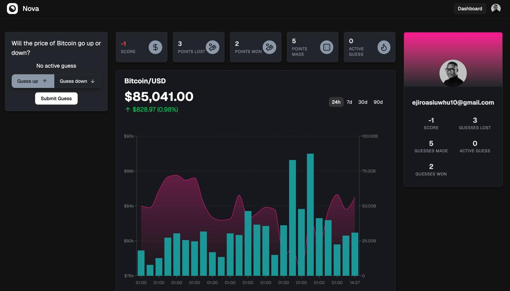

# Nova: Bitcoin Price Prediction Game



A web application that allows users to predict whether the Bitcoin (BTC/USD) price will be higher or lower after one minute.

## Demo
https://github.com/user-attachments/assets/77ddfe3f-268a-4925-92fe-42bbebb5989d


## Important links

- [Backend API](https://nova-backend-production-e68c.up.railway.app/api/v1)
- [Backend API Docs](https://nova-backend-production-e68c.up.railway.app/api/v1/docs)
- [Backend Git Repository](https://github.com/ejirocodes/nova-backend)
- [Frontend](https://thenova.vercel.app)
- [Frontend Git Repository](https://github.com/ejirocodes/nova-client)


## Tech Stack

### Frontend

- **React Router 7** - Modern routing framework for React
- **Clerk** - Authentication and user management
- **TanStack Query** - Data fetching and state management
- **Tailwind CSS** - Utility-first CSS framework
- **Radix UI** - Unstyled, accessible UI components
- **Recharts** - Composable charting library
- **TypeScript** - Static type checking

### Backend

- **NestJS** - Progressive Node.js framework
- **Prisma** - Modern ORM for database interactions
- **AWS Aurora Serverless** - Serverless relational database
- **Clerk** - Authentication service
- **OpenAI** - AI integration
- **Swagger** - API documentation
- **Winston** - Logging library

## End-to-End TypeScript

The project implements a fully type-safe development experience with automated TypeScript client generation:

- **OpenAPI Generator** - Automatically generates TypeScript API clients from backend endpoints
- **Type Consistency** - Ensures type safety between backend and frontend
- **Developer Experience** - Autocompletion and type checking for all API calls

The `api-generation.sh` script fetches the latest OpenAPI specifications from the backend and generates type-safe API clients for the frontend:

```bash
# Generate TypeScript API clients
cd nova-client

bash ./script/api-generation.sh
```

This approach eliminates type inconsistencies and provides a seamless development experience with full IntelliSense support across the entire application.

Read more about this approach in this [video](https://www.youtube.com/watch?v=-CBpQzdtbOg)

## Core Modules

### User Module

- Handles user registration, authentication, and profile management
- Maintains user scores
- Implements secure password hashing and JWT token generation
- Provides user data persistence in Aurora Serverless

### Auth Module

- Manages JWT-based authentication
- Implements auth guards for protected routes
- Provides decorators for role-based access control
- Handles token generation, validation, and refreshing

### Guess Module

- Processes user predictions (up/down)
- Enforces game rules (one guess at a time, 60-second resolution)
- Updates user scores based on prediction outcomes
- Tracks guess status (pending, resolved)
- Provides historical guess data

### Price Module

- Connects to external API for real-time BTC/USD price data
- Caches price data for efficiency
- Triggers guess resolution when price changes
- Provides price change notifications
- Handles price comparison logic for guess resolution

## System Architecture

The application follows a client-server architecture:

1. **Frontend (nova-client)**: Next.js application that provides the UI for users to interact with the game.

2. **Backend (nova-backend)**: NestJS application that handles business logic, data persistence, and external API integration.

3. **Database**: AWS Aurora Serverless for storing user data, guesses, and game history.

4. **External API Integration**: Real-time BTC price data fetched from a third-party source (CoinGecko).

## How It Works

1. **User Authentication**:

   - Authentication is powered by Clerk with webhooks to the backend for user management
   - New users register with google sign in
   - Returning users log in to access their account
   - User data is stored in Clerk and synced to Aurora Serverless Postgres via webhooks

2. **Game Flow**:

   - Users see the current BTC/USD price and their score
   - Users make a prediction (up/down) for the price in 60 seconds
   - System locks further predictions until current one resolves
   - After 60+ seconds and a price change, system evaluates the prediction
   - Score updates (+1 for correct, -1 for incorrect)
   - User can make a new prediction

3. **Price Tracking**:

   - Backend regularly polls BTC price API
   - Price changes trigger guess evaluations
   - Historical prices are stored for verification
   - Price data is cached for 1 minute to reduce API calls and prevent rate limiting
   - Price data is stored in Aurora Serverless Postgres

4. **Score Persistence**:
   - User scores are stored in Aurora Serverless
   - Scores persist between sessions
   - Users can return to see their score and continue playing

## Setup and Deployment

### Prerequisites

- Node.js 20 (`.nvmrc` for details)
- AWS account with Aurora Serverless access
- npm or yarn

### Local Development

**Backend:**

```bash
cd nova-backend
npm install
npm run start:dev
```

**Frontend:**

```bash
cd nova-client
pnpm install
pnpm dev
```

### Environment Variables

Before setting up your environment variables, check the `.env.template` files in both the backend and frontend repositories for the most up-to-date required variables.

### Deployment

The application is deployed using AWS services:

- Frontend: Vercel
- Backend: AWS Elastic Beanstalk
- Database: AWS Aurora Serverless

## Deployment Guide

### Backend Deployment (AWS)

The backend is designed to be deployed as a containerised service on AWS.

#### Option 1: AWS Elastic Beanstalk

1. **Build the application**:

   ```bash
   cd nova-backend
   npm run build
   ```

2. **Create a Dockerfile** in the root of the nova-backend directory:

   ```Dockerfile
   FROM node:20-alpine
   WORKDIR /app
   COPY package*.json ./
   COPY prisma ./prisma/
   COPY dist ./dist/
   RUN npm ci --only=production
   RUN npx prisma generate
   EXPOSE 3000
   CMD ["node", "dist/main"]
   ```

3. **Deploy to Elastic Beanstalk**:

   - Install the EB CLI: `pip install awsebcli`
   - Initialise EB: `eb init`
   - Create environment: `eb create nova-backend-prod`
   - Deploy: `eb deploy`

4. **Configure environment variables** in the Elastic Beanstalk console:
   - DB connection parameters
   - JWT secrets
   - API keys
   - Other service credentials

#### Option 2: AWS ECS (Fargate)

1. **Create ECR repository** for the Docker image
2. **Build and push** the Docker image to ECR
3. **Create ECS cluster** with Fargate launch type
4. **Define task and service** using the ECR image
5. **Configure Auto Scaling** based on your traffic patterns

### Frontend Deployment (Vercel)

The frontend is optimised for deployment on Vercel:

1. **Connect your repository** to Vercel
2. **Configure environment variables**:
   ```
    VITE_API_BASE_URL=
    VITE_CLERK_PUBLISHABLE_KEY=
    VITE_CLERK_SECRET_KEY=
   ```
3. **Deploy**:
   - Either through the Vercel dashboard
   - Or using the Vercel CLI:
     ```bash
     cd nova-client
     vercel
     ```
     See [Vercel docs](https://vercel.com/docs/cli) for more information

### Database Deployment (AWS Aurora Serverless)

1. **Create Aurora Serverless cluster** in the AWS Console
2. **Configure security groups** to allow access from your backend service
3. **Run migrations**:
   ```bash
   cd nova-backend
   npx prisma migrate deploy
   ```

### Domain and SSL

1. **Register domain** with AWS Route 53 or your preferred provider
2. **Configure DNS** to point to your services
3. **Set up SSL certificates** using AWS Certificate Manager

## Testing

The application includes:

- Unit tests for core business logic
- Integration tests for API endpoints
- E2E tests for critical user flows

Run tests with:

```bash
npm run test
```

## Future Improvements

- Real-time updates using WebSockets
- User leaderboards
- More sophisticated prediction options
- Mobile app version
